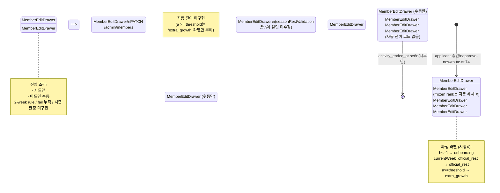
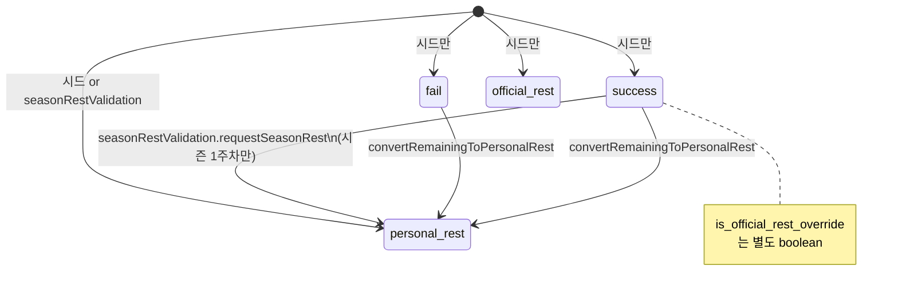
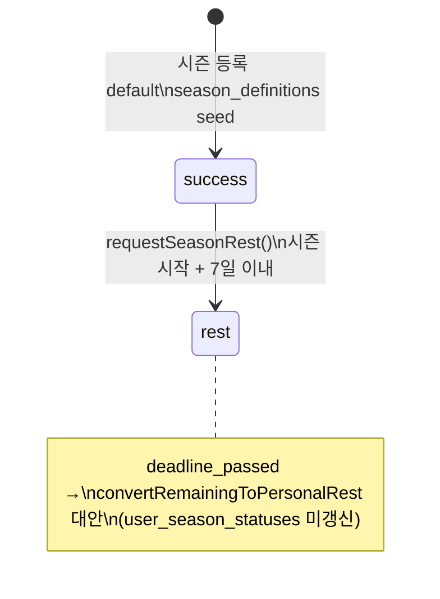

# User Status Domain Technical Mapping 감사 보고서

**감사 일자**: 2026-05-28
**범위**: `user_profiles.status`, `user_profiles.growth_status`, `user_season_statuses`, `user_week_statuses` 및 모든 상태 전이 코드 경로
**감사 원칙**: 읽기 전용, 코드/마이그레이션 수정 없음
**선행 감사 정렬**:
- `claudedocs/source-of-truth-audit-20260528.md` (특히 1-1 주간 상태 SoT)
- `claudedocs/growth-domain-technical-mapping-audit-20260528.md` (4 지표 산출 경로)
- `claudedocs/season-domain-mapping-audit-20260528.md` (a~h 계산 경로 + display key 우선순위)

본 보고서는 선행 감사가 다룬 **숫자 카운팅(a~h)** 영역이 아니라 **"문자열 상태 라벨이 어디서 쓰여지고 / 읽혀지고 / 표시되는가"** 에 집중한다.

---

## 0. 핵심 개요 (TL;DR)

본 프로젝트는 사용자 상태를 **세 개의 직교 차원**에서 관리한다:

| 차원 | 컬럼/테이블 | 정의 위치 | 카디널리티 |
|------|------------|----------|-----------|
| 계정 활성 | `user_profiles.status` | seed/이관에서는 `weekly_rest`, `seasonal_rest`, `paused`, `graduated`, `suspended`, `active`를 같이 저장. `lib/adminAccountsData.ts:431,579`에서는 `'active' / 'inactive'` 만 토글 | 의미 충돌 (이중 용도) |
| 성장 라이프사이클 | `user_profiles.growth_status` | 명시적 CHECK 제약 **없음**. 코드 사용 값 = `active`, `paused`, `suspended`, `seasonal_rest`, `weekly_rest`, `graduating`, `graduated` (7종) | 단일 row 단일 상태 |
| 시즌 단위 | `user_season_statuses.status` | DB CHECK: `'success' | 'rest'` (`2026-05-25_season_definitions_and_user_seasons.sql:100-101`) | (user, season_key) 다중 |
| 주차 단위 | `user_week_statuses.status` | DB CHECK: `'success' | 'fail' | 'personal_rest' | 'official_rest'` (`2026-05-25_cluster3_growth_indicators.sql:39-40`) | (user, year, week) 다중 |

요청한 12종 상태 중 **DB가 `growth_status`에 실제 저장하는 7종**: `active`, `paused`, `suspended`, `seasonal_rest`, `weekly_rest`, `graduating`, `graduated`.
요청한 12종 상태 중 **표시(derived) 전용 3종**: `onboarding`, `extra_growth`, `official_rest` — `cluster3GrowthData.ts:109-130`에서 다른 컬럼 조합으로 계산되어 라벨로만 나타남.
요청한 12종 상태 중 **현재 코드에서 `growth_status` 값으로는 미사용**: `personal_rest` (오직 `user_week_statuses.status`에만 존재).

---

## 1. 상태 목록 (Status Inventory)

### 1-A. `user_profiles.growth_status` 에 저장되는 7개 값

| 값 | 저장 위치 | 쓰기 위치 (코드/SQL) | 읽기 위치 (코드) | 표시 라벨 (한) | 의미 | 비고 |
|----|----------|---------------------|-----------------|--------------|------|------|
| `active` | `user_profiles.growth_status` | `app/api/admin/applicants/[id]/approve-new/route.ts:74`, `lib/adminAccountsData.ts:432`, `db/migrations/2026-05-22_account_management_step2_backfill_operators.sql:64`, 시드 `2026-05-25_cluster3_growth_seed_diversify.sql:70,79,97,133,154,172,176` | `lib/cluster3GrowthData.ts:109-130`, `lib/cluster4WeeklyGrowthData.ts:255-266`, `db/migrations/2026-05-25_official_rest_weeks_and_override.sql:121,172` | `성장 중` (`cluster3GrowthTypes.ts:40`) | 기본 활동 중 | 신규 승인 시 기본값 |
| `paused` | 동일 | seed `2026-05-25_cluster3_growth_seed_diversify.sql:132` | `cluster3GrowthData.ts:119`, `cluster4WeeklyGrowthData.ts:266` | `성장 유보` | 활동 일시 정지 | `growth_status` 7종 + `user_profiles.status` 7종 양쪽에 등장 (이중 표시 가능) |
| `suspended` | 동일 | seed `2026-05-25_cluster3_growth_seed_diversify.sql:152` | `cluster3GrowthData.ts:118`, `cluster4WeeklyGrowthData.ts:265`, `cluster3ClubRankData.ts:74`, `2026-05-25_club_rank_weekly_points.sql:219` | `성장 중단` | 강제 중단/실패 누적 | 등급 frozen 처리 트리거 |
| `seasonal_rest` | 동일 | seed `2026-05-25_cluster3_growth_seed_diversify.sql:131`, seed-90 `claudedocs/seed-90users-v2-20260526.sql:343,345,347` | `cluster3GrowthData.ts:121`, `2026-05-25_season_definitions_and_user_seasons.sql:152` (시드 분류만) | `시즌 휴식 중` | 시즌 전체 휴식 | **런타임 쓰기 코드 없음** — `seasonRestValidation.ts`는 `user_season_statuses`만 갱신, `user_profiles.growth_status`는 손대지 않음 |
| `weekly_rest` | 동일 | seed `2026-05-25_cluster3_growth_seed_diversify.sql:130`, seed-90 `claudedocs/seed-90users-v2-20260526.sql:345` (`profile_status='weekly_rest'`) | `cluster3GrowthData.ts:122` | `휴식(개인) 중` | 주간(개인) 휴식 | **런타임 쓰기 코드 없음** — seed 외 변경 경로 미구현 |
| `graduating` | 동일 | seed `claudedocs/seed-90users-v2-20260526.sql:373,376,379` | `cluster3GrowthData.ts:120` | `졸업 절차 중` | 졸업 임계치 도달 후 절차 진행 | **운영 코드에 자동 전이 없음**. `cluster3GrowthData.ts:128`는 `growth_status='active' + a>=threshold` 사용자를 `extra_growth` 라벨로 분류 — `graduating` 상태로 자동 승격하지 않음 |
| `graduated` | 동일 | seed `2026-05-25_cluster3_growth_seed_diversify.sql:180,185,190`, seed-90 `382,386` | `cluster3GrowthData.ts:117`, `cluster4WeeklyGrowthData.ts:255-263`, `cluster3ClubRankData.ts:74`, `2026-05-25_club_rank_weekly_points.sql:219`, `2026-05-25_official_rest_weeks_and_override.sql:103,154` | `성장 완료(졸업)` | 졸업 완료 | 등급 frozen 처리, `activity_ended_at` 설정 (`2026-05-25_cluster3_growth_indicators.sql:128-131`) |

### 1-B. 계산(파생) 표시 상태 — `growth_status` 컬럼에는 저장되지 않음

`resolveDisplayKey()` (`lib/cluster3GrowthData.ts:109-130`)이 DB값 + Period(a/h) + 현재 주차 상태를 조합하여 결정한다:

| 표시 키 | 조건 (`cluster3GrowthData.ts`) | 표시 라벨 | 비고 |
|---------|-------------------------------|----------|------|
| `official_rest` | `dbStatus` 비매칭 + `currentWeekStatus === 'official_rest'` (line 126) | `휴식(공식) 중` | 현재 주차 `user_week_statuses.status`에서 파생. `cluster3GrowthTypes.ts:25` 우선순위 #4 |
| `onboarding` | `dbStatus` 비매칭 + `h <= 1` (line 127) | `클럽 온보딩 중` | "1주차 이하"라는 의미. 신규 가입자 자동 분류 |
| `extra_growth` | `dbStatus` 비매칭 + `a >= graduationThreshold` (line 128) | `추가 성장 중` | 졸업 임계치 도달 but 졸업 처리 미실행 |

### 1-C. `user_profiles.status` 에 저장되는 값 — **이중 도메인 충돌**

`user_profiles.status` 컬럼은 **두 가지 의미로 동시 사용**된다:

- **도메인 1 (계정 활성도, 단순 boolean)**: `'active' | 'inactive'` (`lib/adminAccountsData.ts:431,579`). admin 계정 생성/비활성화 토글 전용. 운영 코드에서 쓰는 유일한 값 페어.
- **도메인 2 (성장 라이프사이클 미러)**: `'active' | 'weekly_rest' | 'seasonal_rest' | 'paused' | 'graduated' | 'suspended'` (`lib/adminAppUsersTypes.ts:5-12` `APP_USER_STATUSES`). 시드/이관 데이터에서 사용되며 (`claudedocs/seed-90users-v2-20260526.sql:345,382,386,407`), `cluster1ResumeData.ts:25-35`에서 Resume 배지로 매핑.

소비처:
| 위치 | 사용 의미 | 파일:라인 |
|------|---------|----------|
| 신규 어드민 계정 생성 | 계정 활성도 | `lib/adminAccountsData.ts:431` |
| 어드민 계정 활성/비활성 토글 | 계정 활성도 | `lib/adminAccountsData.ts:579` |
| Resume 배지 매핑 (Cluster1) | 성장 라이프사이클 | `lib/cluster1ResumeData.ts:23-46,452` |
| Resume 카드 표시 | 성장 라이프사이클 | `components/admin/ResumeCardEditor.tsx:750,1131` |
| Members 목록/검색/수정 | 두 도메인 혼재 | `lib/adminMembersData.ts:102-103`, `components/admin/MembersList.tsx:476-485`, `components/admin/MemberEditDrawer.tsx:264-282` |
| App users 목록/필터 | 성장 라이프사이클 | `lib/adminAppUsersData.ts:81-83` (필터값 = `APP_USER_STATUSES`) |
| Olympus 이관 매핑 | 성장 라이프사이클 | `claudedocs/olympus-vraxium-field-mapping-matrix-20260522.md:139,144,151,199` (`restdates / stopuserlogs / graduateusers` → `user_profiles.status`) |

`Resume STATUS_MAP` (`cluster1ResumeData.ts:25-35`):
```
active        → running
graduated     → complete
weekly_rest   → on_rest
seasonal_rest → recharging
paused        → next_challenge
suspended     → next_challenge
(else)        → next_challenge
```

### 1-D. `user_season_statuses.status` — DB CHECK 강제

| 값 | 의미 | 쓰기 | 읽기 |
|----|------|------|------|
| `success` | 시즌 통과 (성공) | `seasonRestValidation.ts` 외 경로 없음; 시드 `2026-05-25_season_definitions_and_user_seasons.sql:147-170` | `cluster3GrowthData.ts:160-163` (g 카운트), `cluster4WeeklyGrowthData.ts:197-201` |
| `rest` | 시즌 전체 휴식 | `lib/seasonRestValidation.ts:56-67` (upsert), 시드 동일 | 동일 |

DB CHECK: `CHECK (status IN ('success', 'rest'))` (`2026-05-25_season_definitions_and_user_seasons.sql:100-101`).

### 1-E. `user_week_statuses.status` — DB CHECK 강제

| 값 | 의미 | 쓰기 | 읽기 |
|----|------|------|------|
| `success` | 인정 활동 | 시드 SQL 다수, `seasonRestValidation.ts`에는 직접 success 쓰기 없음 (역방향만) | a 카운트 (`cluster3GrowthData.ts:148`), `cluster4WeeklyGrowthData.ts:224`, `cluster1ResumeData.ts:94` |
| `fail` | 미인정 활동 | 시드만 | b 카운트 동일 |
| `personal_rest` | 개인 휴식 | `lib/seasonRestValidation.ts:80-86,125-131` (운영 코드 유일), 시드 | c 카운트 동일 |
| `official_rest` | 공식 휴식 | 시드 `cluster3GrowthData.ts` 등록 시뮬레이션, 시드만 — 런타임 쓰기 없음 | d 카운트 (`cluster3GrowthData.ts:151`), Cluster4는 **무시함** (참고: season-mapping-audit FINDING-01) |

DB CHECK: `CHECK (status IN ('success','fail','personal_rest','official_rest'))` (`2026-05-25_cluster3_growth_indicators.sql:39-40`).

### 1-F. 보조 컬럼

| 컬럼 | 의미 | 정의 |
|------|------|------|
| `user_week_statuses.is_official_rest_override` | "공식 휴식 주차에 활동 인정" 메타플래그. status는 success | `2026-05-25_official_rest_weeks_and_override.sql:64-68` |
| `user_season_statuses.requested_at` | 시즌 휴식 신청 시각 (deadline 검증용) | `2026-05-25_season_rest_request_policy.sql:23` |
| `user_profiles.activity_started_at`, `activity_ended_at` | 활동 시작/종료일 (graduated/suspended 시 ended 설정) | `2026-05-25_cluster3_growth_indicators.sql:19-25, 128-131` |

### 1-G. 누락/중복 분석

| 요청 상태 | DB에 저장되는가 | 코드에서 결정되는가 | 결론 |
|-----------|---------------|-------------------|------|
| `active` | 예 (3 컬럼 모두) | 예 | 정상 |
| `graduated` | 예 (growth_status + status) | 예 | 이중 저장 (sync 보장 없음) |
| `graduating` | 시드에만 (운영 쓰기 없음) | 표시: yes, 자동 전이: **없음** | 자동화 누락 |
| `paused` | 예 (growth_status); 시드/이관에서 status에도 가능 | 예 | 이중 저장 가능 |
| `suspended` | 예 (growth_status + status) | 예 | 이중 저장 |
| `seasonal_rest` | growth_status에 시드만; user_season_statuses에 `rest`로 정규화 | 예 | 정규화 깨짐 (런타임에서 growth_status 자동 갱신 없음) |
| `weekly_rest` | growth_status에 시드만; user_week_statuses에 `personal_rest`로 정규화 | 예 | 정규화 깨짐 (런타임에서 growth_status 자동 갱신 없음) |
| `onboarding` | 저장 안 함 | `h <= 1` 계산 | 정상 (파생) |
| `extra_growth` | 저장 안 함 | `a >= threshold` 계산 | 정상 (파생) |
| `official_rest` | user_week_statuses에 `official_rest`로 저장. growth_status에는 저장 안 함 | `currentWeekStatus === 'official_rest'` 계산 | 정상 (파생) |
| `personal_rest` | user_week_statuses에 `personal_rest`로 저장. growth_status에 저장하지 않음 | 표시 키 없음 (`weekly_rest` 라벨로 합쳐짐) | 컨벤션 불일치 |

---

## 2. 상태 전이 (State Transitions)

### 2-A. 입출 조건 매트릭스

| Status | 진입 조건 (Entry) | 이탈 조건 (Exit) | 자동 vs 수동 | 어드민 오버라이드 | 메커니즘 |
|--------|------------------|----------------|------------|----------------|---------|
| `active` (growth_status) | (a) 승인 시 default (`approve-new/route.ts:74`), (b) 어드민 계정 생성 시 default (`adminAccountsData.ts:432`), (c) `MemberEditDrawer`에서 수동 지정 | 어드민이 수동 변경 외에는 없음 | 자동 (진입) + 수동 (전이) | 예 (`/api/admin/members/[user_id] PATCH`, `lib/adminMembersData.ts:264-287`) | API + UI |
| `graduating` | 시드에서만 (`seed-90users-v2-20260526.sql:373,376,379`) | 시드에서만 | 수동 (시드) | 예 (MemberEditDrawer) | UI 수동 |
| `graduated` | 시드에서만 (`cluster3_growth_seed_diversify.sql:180,185,190`) | (사실상 없음) | **자동 전이 없음** | 예 (MemberEditDrawer) | UI 수동만 |
| `paused` | 시드 (`cluster3_growth_seed_diversify.sql:132`) or 어드민 수동 | 어드민 수동 | 수동 | 예 | UI 수동 |
| `suspended` | 시드 (`cluster3_growth_seed_diversify.sql:152`) or 어드민 수동 | 어드민 수동 | 수동 | 예 | UI 수동 |
| `seasonal_rest` (growth_status) | 시드만 — **운영 경로 미구현** | 어드민 수동 | 수동 | 예 | UI 수동 |
| `weekly_rest` (growth_status) | 시드만 — **운영 경로 미구현** | 어드민 수동 | 수동 | 예 | UI 수동 |
| `status='active'` (profile) | applicant 승인 (`approve-new/route.ts:73`), 어드민 계정 생성 (`adminAccountsData.ts:431`) | 어드민 비활성화 토글 | 자동 (생성) + 수동 | 예 | API |
| `status='inactive'` (profile) | 어드민 비활성화 토글 (`adminAccountsData.ts:579`) | 어드민 활성화 토글 | 수동 | 예 | API |
| `user_week_statuses.status='personal_rest'` | (a) 시즌 휴식 신청 시 1주차 자동 (`seasonRestValidation.ts:80-86`), (b) `convertRemainingToPersonalRest()` 호출 (`seasonRestValidation.ts:125-131`), (c) 시드 | 어드민 수동 (UI 없음) | 자동 (시즌 휴식 시) + 수동 | 코드상 직접 변경 UI 없음 — DB 직접 변경만 가능 | API (`requestSeasonRest`) |
| `user_week_statuses.status='success'/'fail'/'official_rest'` | 시드만 — **런타임 쓰기 코드 없음** | — | 시드만 | DB 직접 | (없음) |
| `user_season_statuses.status='rest'` | `seasonRestValidation.requestSeasonRest()` (`lib/seasonRestValidation.ts:56-67`), 시드 (`season_definitions_and_user_seasons.sql:147-170`) | `success`로 직접 갱신하는 코드 없음 | 자동 (API) | API 호출 외 직접 변경 없음 | API |
| `user_season_statuses.status='success'` | 시즌 첫 등록 시 default (`season_definitions_and_user_seasons.sql:151`), 시드 | 위와 동일 | 자동 (시드/시즌 첫 행) | 예 (DB 직접만) | (시드만) |

### 2-B. 트리거/크론/잡 존재 여부

| 카테고리 | 존재 여부 | 검증 |
|---------|----------|------|
| DB 트리거 (`growth_status` 자동 갱신) | **없음** | `db/migrations`에 `CREATE TRIGGER` 검색 — `growth_status` 관련 트리거 0건 |
| DB 트리거 (`status` 자동 갱신) | **없음** | 동일 |
| DB 트리거 (시즌/주차 → growth_status 자동 동기화) | **없음** | 동일 |
| 크론 (`app/api/cron/`) | **없음** | `Glob app/api/cron/**` → 결과 0 |
| 스케줄 작업 | **없음** | `vercel.json` / `pg_cron` / `scripts/` 어디에도 status 갱신 스케줄러 없음 |
| 트리거 (있는 것) | `sync_cumulative_on_weekly_change` (포인트 누적 — status 영향 없음, `2026-05-28_cumulative_points_auto_sync.sql:157-160`), `*_set_updated_at` 다수 (단순 updated_at 갱신) | — |

**핵심 결론**: 사용자 상태 7종(growth_status) 사이의 자동 전이는 **단 한 건도 구현되어 있지 않다**. 모든 전이는 (a) 시드 SQL의 초기 분류 (b) 어드민 수동 UI를 통한 직접 변경, 이 두 가지 경로뿐이다.

---

## 3. 졸업 시스템 감사 (Graduation)

### 3-A. 졸업 임계치 (`graduationThreshold`)

| 조직 | 임계치 | 정의 위치 |
|------|--------|----------|
| `encre` | 30 | `lib/pointLabels.ts` (via `getGraduationThreshold`) — 사용은 `cluster3GrowthData.ts:143` |
| `phalanx` | 30 | 동일 |
| `oranke` | 25 | 동일. 시드/검증 쿼리: `2026-05-25_cluster3_growth_indicators.sql:321-324` |

### 3-B. 졸업 판정 함수

**파생 라벨 결정** (`lib/cluster3GrowthData.ts:128`):
```ts
if (graduationThreshold !== null && a >= graduationThreshold) return "extra_growth";
```
→ "임계치 도달 + growth_status 비매칭(=active)"인 사용자에게 **`extra_growth` 라벨**을 부여. `graduating` 상태로 자동 승격하지 않음.

**시즌 종료 판정**: 코드에 `season-end processing` 함수 없음. `season_definitions`의 `end_date` 도달 시 자동 처리하는 코드/트리거/크론 **없음**.

### 3-C. 호출 위치

| 호출자 | 결과 사용 |
|--------|----------|
| `cluster3GrowthData.ts:143` (`getGraduationThreshold(orgValid)`) | `_debug.graduationThreshold` (DTO) + `displayKey='extra_growth'` 분기 |
| `_debug.graduationEligible = threshold !== null && a >= threshold` (`cluster3GrowthData.ts:211`) | DTO 디버그 필드 — 운영 UI 미반영 (외부 노출 X, 내부 internal DTO만) |
| `2026-05-25_cluster3_growth_indicators.sql:320-334` 검증 쿼리 (주석 처리됨) | 사람이 SQL Editor에서 직접 실행하여 확인 — 자동화 없음 |

### 3-D. 자동 졸업 여부

**아니오**.
- `extra_growth` (= 임계치 달성)인 사용자는 라벨만 바뀌고 `growth_status`는 `active` 유지
- `graduating`으로의 자동 전이 코드/SQL 없음
- `graduated`로의 자동 전이 코드/SQL 없음
- `activity_ended_at` 자동 설정 코드 없음 (시드에서만 설정: `2026-05-25_cluster3_growth_indicators.sql:128-131`)

### 3-E. "예정 졸업" 상태 존재 여부

코드에서 사용 가능한 두 가지가 비슷한 의미:
1. **`extra_growth`** (파생 라벨): 임계치 달성. 가장 가까운 "예정 졸업" 의미.
2. **`graduating`** (DB 저장 라벨): 시드에서만 부여, 운영 자동 전이 없음 — 사실상 dead label.

두 라벨은 **동시에 존재 불가**: `resolveDisplayKey()` switch에서 `graduating`이 먼저 매칭되면 `extra_growth` 분기를 타지 않는다 (`cluster3GrowthData.ts:120` vs `:128`).

### 3-F. `graduating → graduated` 전이 타이밍

**자동 전이 코드 없음**. seed 데이터에서 별도 행으로 분류되어 있을 뿐 (`seed-90users-v2-20260526.sql:382,386`은 graduating 거치지 않고 직접 graduated 설정).

운영 시 가능한 유일한 전이 경로: 어드민이 `/admin/members` UI에서 `MemberEditDrawer`로 수동 변경 (`components/admin/MemberEditDrawer.tsx:289-309`).

### 3-G. `extra_growth` 진입 조건

```ts
// cluster3GrowthData.ts:127-128
if (h <= 1) return "onboarding";
if (graduationThreshold !== null && a >= graduationThreshold) return "extra_growth";
```
조건: `growth_status` ∈ {null, active} **AND** `currentWeekStatus !== 'official_rest'` **AND** `h > 1` **AND** `a >= graduationThreshold` (org별 25 or 30).

### 3-H. 시즌 종료 처리

코드에서 **없음**. season_definitions의 `end_date`에 도달했을 때 자동으로 무언가를 갱신하는 코드/트리거/크론은 존재하지 않는다.

`weeks.is_official_rest`의 transition 주차 (`seasonCalendar.ts:49-61`) 정의가 있으나 user_week_statuses CHECK는 transition을 허용하지 않음 — 사용자별 시즌 전환 주차 status 기록 정책 부재 (참고: season-mapping FINDING-07).

---

## 4. 휴식 상태 감사 (Rest States)

### 4-A. 4종의 휴식 개념

| 휴식 | 저장 위치 | 카디널리티 | 생성 |
|------|----------|-----------|------|
| `growth_status='weekly_rest'` | `user_profiles.growth_status` | 1 (사용자별) | 시드만 |
| `growth_status='seasonal_rest'` | `user_profiles.growth_status` | 1 (사용자별) | 시드만 |
| `user_season_statuses.status='rest'` | `user_season_statuses` | N (사용자×시즌) | `seasonRestValidation.ts:56-67` |
| `user_week_statuses.status='personal_rest'` | `user_week_statuses` | N (사용자×주차) | `seasonRestValidation.ts:80-86,125-131`, 시드 |
| `user_week_statuses.status='official_rest'` | `user_week_statuses` | N (사용자×주차) | 시드만 (런타임 쓰기 없음) |
| `is_official_rest_override=true` | `user_week_statuses` | 0/1 (행별 boolean) | 시드만 |

### 4-B. 개념 비교 — 별개 / 중첩 / 계층?

**계층적 (의도) + 중복 저장 (구현)**:
- 시즌 전체 휴식 (정규화): `user_season_statuses.status='rest'` (시즌 단위 카운터)
  - → 효과: 해당 시즌 1주차를 `user_week_statuses.status='personal_rest'`로 자동 전환 (`seasonRestValidation.ts:80-86`)
- 시즌 전체 휴식 (변동): `user_profiles.growth_status='seasonal_rest'` — **별도로 저장되지만 운영 코드에서 자동 갱신하지 않음**

마찬가지로:
- 개인 1주 휴식 (정규): `user_week_statuses.status='personal_rest'`
- 개인 1주 휴식 (변동): `user_profiles.growth_status='weekly_rest'` — **별도로 저장되지만 운영 코드에서 자동 갱신하지 않음**
- 공식 휴식 (정규): `user_week_statuses.status='official_rest'`
- 공식 휴식 (파생 라벨): `displayKey='official_rest'` (`cluster3GrowthData.ts:126`) — 현재 주차 한정

### 4-C. 우선순위 충돌

`resolveDisplayKey()` (`cluster3GrowthData.ts:109-130`) 우선순위 — 위에서부터 매칭:
1. `graduated` (highest)
2. `suspended`
3. `paused`
4. `graduating`
5. `seasonal_rest`
6. `weekly_rest`
7. (이후 dbStatus 비매칭 → 계산식 진입)
8. `official_rest` (현재 주차)
9. `onboarding` (h<=1)
10. `extra_growth` (a>=threshold)
11. `active` (default)

**충돌 시나리오**:
- `growth_status='seasonal_rest'` AND `user_season_statuses` rest 없음 → 표시는 `seasonal_rest` (DB값 우선), 카운팅(f)은 0. 불일치.
- `growth_status='weekly_rest'` AND 현재 주차 `user_week_statuses.status='success'` → 표시는 `weekly_rest`, 실제 활동은 인정. 불일치.

### 4-D. 표시 규칙

`GROWTH_DISPLAY_LABELS` (`cluster3GrowthTypes.ts:30-41`):
- `seasonal_rest` → "시즌 휴식 중"
- `weekly_rest` → "휴식(개인) 중"
- `official_rest` → "휴식(공식) 중"
- (`personal_rest`는 표시 키 없음 — `weekly_rest` 라벨에 흡수됨)

### 4-E. 계산 제외 규칙

| 휴식 | 일정 신뢰도 영향 (`cluster1ResumeData.ts:54-123`) | 활동 완료율 영향 | 주차 성장률 k |
|------|---------------------------------------------|--------------|-------------|
| `personal_rest` (b) | 분자에 +1 (`((d+b)/(a-e))×100`, line 110-112) | 분모(가용 주차)에서 제외 | 휴식 주차는 가용 라인 0/0 |
| `official_rest` (e) | 분모에서 e만큼 차감 (line 109) | 분모에서 제외 | 동일 |
| `is_official_rest_override` | 영향 없음 (status='success'로 이미 a 가산. e는 가산 안 됨) | 활동으로 계산 | 활동으로 계산 |
| `growth_status='seasonal_rest'/'weekly_rest'` | **영향 없음** (a~h 계산은 user_week_statuses만 봄) | 동일 | 동일 |

### 4-F. 어드민 오버라이드 가능 여부

| 상태 | 어드민 UI 변경 가능? | 위치 |
|------|-------------------|------|
| `growth_status` (모든 값) | 예 | `MemberEditDrawer.tsx:289-309`, `lib/adminMembersData.ts:264-287` (`PATCH /api/admin/members/[user_id]`) |
| `user_season_statuses.status` | **UI 없음** | API 직접 호출만 가능 (`requestSeasonRest`) |
| `user_week_statuses.status` | **UI 없음** | DB 직접 변경만 가능 |
| `is_official_rest_override` | **UI 없음** | DB 직접 변경만 가능 |

---

## 5. Paused / Suspended 감사

### 5-A. 자동 진입 조건

**없음**.

코드 검색 결과:
- "fail >= N 회 → suspended" 룰 없음
- "활동 X주 누적 미수행 → paused" 룰 없음
- 시즌 단위 판정 함수 없음 (Cluster3 `buildIndicators`만 f/g 카운트, 트리거 없음)
- 자동 강등 트리거/크론 없음

시드에서만 `'suspended'` (`cluster3_growth_seed_diversify.sql:152`, "그룹 E 실패 누적"), `'paused'` (`cluster3_growth_seed_diversify.sql:132`, "그룹 D #20")로 할당됨.

### 5-B. "2주 룰" 존재 여부

**없음**. 코드/SQL 어디에도 "2 weeks" 누적 룰 (2주 연속 fail / 2주 연속 미활동 → 자동 paused) 구현되어 있지 않다.

`seasonRestValidation.ts:46-48`의 "시즌 시작일 + 7일 데드라인"이 코드에 존재하는 유일한 N-day 룰 (시즌 휴식 신청 마감 시한).

### 5-C. Fail 누적 기준

**없음**. `b` (fail) 카운트는 표시 전용. fail 횟수에 따른 상태 전이 룰 없음.

### 5-D. 시즌 단위 판정

**없음**. 시즌 종료 시 사용자별 success/fail/rest 판정하는 코드/트리거 없음.

`user_season_statuses`는 다음 조건에서만 INSERT/UPDATE:
- 시드 (`season_definitions_and_user_seasons.sql:147-170`): 시즌 진행 중인 시즌은 default `success`로 미리 저장
- `seasonRestValidation.requestSeasonRest()`: 신청 시 `rest`로 upsert

→ "시즌 종료 후 결과 확정"하는 자동 처리는 없음.

### 5-E. 복구 조건

**자동 복구 없음**. `growth_status='paused'` 또는 `'suspended'` 사용자가 자동으로 `active`로 돌아오는 경로 없음. 어드민 UI 수동 변경만 가능 (`MemberEditDrawer`).

### 5-F. 어드민 수동 잠금 해제

가능: `PATCH /api/admin/members/[user_id]` → `growth_status: 'active'` 지정.

추가 부수 효과:
- 등급 frozen 처리(`user_club_rank_frozen`)는 `growth_status IN ('graduated', 'suspended')` 시 갱신 (`2026-05-25_club_rank_weekly_points.sql:201-224`). 그러나 이는 **마이그레이션 1회성** — frozen 행은 한 번 생성되면 자동으로 unfreeze 되지 않음. suspended 사용자 풀어줘도 frozen 상태 유지.

---

## 6. 화면별 SSOT (Source of Truth per Screen)

| 화면 | 위치 | 사용하는 상태 필드 | 위치 (코드) |
|------|------|-----------------|------------|
| Resume | `components/admin/ResumeCardEditor.tsx` + `lib/cluster1ResumeData.ts:446-450,452,463` | `user_profiles.status` → `STATUS_MAP` (`cluster1ResumeData.ts:25-35`) → ResumeBadge | "user_profiles.status → resume badge mapping" 주석 명시 (`ResumeCardEditor.tsx:750`) |
| Cluster3 | `components/admin/Cluster3Editor.tsx` + `lib/cluster3GrowthData.ts:165-167` | `user_profiles.growth_status` + 현재 주차 + (a, h, threshold) → `displayKey` | `resolveDisplayKey()` (`cluster3GrowthData.ts:109-130`) |
| Cluster4 | `components/admin/Cluster4Editor.tsx` + `lib/cluster4WeeklyGrowthData.ts:255-276` | `user_profiles.growth_status` (graduated/suspended/paused만 확인) → `endStatus` | `endStatus` 3종 (`completed/stopped/in_progress`) |
| Members | `components/admin/MembersList.tsx` + `lib/adminMembersData.ts:29-40` | **두 컬럼 모두 노출**: `status` + `growth_status` | `MEMBER_SELECT` (line 29-40), 표 헤더 (`MembersList.tsx:86-87`), 필터 (`:476-485`) |
| Crew List | `components/admin/CrewManager.tsx` + `lib/adminCrewData.ts` | `user_profiles.growth_status` (간접 — Cluster3/4 진입을 통해서만 노출). Crew DTO 자체에는 status 필드 미포함 (audit `source-of-truth-audit-20260528.md:230-243` 참조) | — |
| Admin Dashboard | `app/(portal)/admin/page.tsx` + `lib/adminDashboardData.ts` | status 노출 **없음**. 가입 신청 status(`applicants.status='pending'`)만 카운트 (`adminDashboardData.ts:182,198`) | (대시보드는 status 표시 미사용) |
| App Users | `lib/adminAppUsersData.ts:81-83` + `app/(portal)/admin/users/app-users/page.tsx` | `user_profiles.status` (필터: `APP_USER_STATUSES` 6종) | — |
| MemberEditDrawer | `components/admin/MemberEditDrawer.tsx:264-309` | `status` + `growth_status` (각각 `APP_USER_STATUSES`로 선택) | 두 컬럼 모두 같은 6종 옵션 사용 — 도메인 분리 미고려 |

**핵심 발견**:
- Resume = `status`에 의존 (성장 라이프사이클 미러 의미)
- Cluster3/4 = `growth_status`에 의존
- 동일 사용자의 동일 의미(예: "졸업했음")가 화면마다 다른 컬럼에서 읽힘 → 두 컬럼 값이 일치하지 않으면 **화면 간 불일치 발생**

---

## 7. 중복 저장 (Duplicate Storage)

### 7-A. 같은 의미가 여러 테이블에 저장

| 의미 | 위치 1 | 위치 2 | 위치 3 |
|------|--------|--------|--------|
| "졸업했음" | `user_profiles.growth_status='graduated'` | `user_profiles.status='graduated'` (시드에서만 set) | `user_profiles.activity_ended_at` not null |
| "중단됨" | `growth_status='suspended'` | `status='suspended'` (시드만) | `activity_ended_at` not null |
| "유보됨" | `growth_status='paused'` | `status='paused'` (시드만) | — |
| "시즌 휴식" | `growth_status='seasonal_rest'` | `user_season_statuses.status='rest'` (정규) | (시드 일부) `user_profiles.status='weekly_rest'` |
| "주간 휴식" | `growth_status='weekly_rest'` | `user_week_statuses.status='personal_rest'` (정규) | — |

### 7-B. 파생값 저장

| 값 | 정의 (계산) | 저장 위치 | 갱신 방식 |
|----|------------|----------|----------|
| `user_growth_stats.approved_weeks` = COUNT(user_week_statuses where status='success') | `user_week_statuses` | `user_growth_stats.approved_weeks` | **수동 재집계** (`seasonRestValidation.ts:94-100,139-145`), 마이그레이션 (참조: source-of-truth audit 2-3) |
| `user_growth_stats.cumulative_weeks` = COUNT(*) | 동일 | `user_growth_stats.cumulative_weeks` | 동일 |
| `user_club_rank_frozen.avg_percentile/rank_grade` | `user_weekly_points` 누적 백분위 | `user_club_rank_frozen` | 마이그레이션 1회성 — graduated/suspended에 대해서만 (`2026-05-25_club_rank_weekly_points.sql:201-224`) |
| `user_grade_stats` | live + frozen 합성 | `user_grade_stats` | 마이그레이션에서 1회 backfill (`2026-05-25_user_grade_stats_sync.sql:186-194`). 런타임 트리거 없음 |

### 7-C. 캐시 저장

`user_growth_stats`, `user_club_rank_frozen`, `user_grade_stats` 모두 캐시 성격. 동기화 트리거 부재.

### 7-D. 계산 가능한데 저장하는 값

| 값 | 계산식 | 왜 저장하는가 |
|----|--------|-------------|
| `approved_weeks` | COUNT(success) on `user_week_statuses` | 크루 목록/리즈메 표시 성능 |
| `cumulative_weeks` | COUNT(*) on `user_week_statuses` | 동일 |
| `activity_ended_at` (graduated/suspended) | "마지막 success week_start_date" 또는 "정책 결정 시각" — 실제로는 `updated_at`을 그냥 복사 (`2026-05-25_cluster3_growth_indicators.sql:128-131`) | 표시 |
| `displayKey` (`growthStatusDisplay`) | `resolveDisplayKey()` 출력 | 항상 계산 (저장 X) |
| `user_club_rank_frozen` | 졸업 시점 백분위 | 졸업 후에도 등급 유지 표시 |

---

## 8. 상태 충돌 (State Conflicts)

요청한 4가지 조합:

### 8-A. `graduated` + `active`

| 조합 | 가능한가? | 어떻게 |
|------|---------|--------|
| `growth_status='graduated'` AND `status='active'` | **예** | DB CHECK 없음. 어드민이 두 컬럼을 따로 변경 가능. seed 다수가 이런 조합으로 들어옴 (예: `cluster3_growth_seed_diversify.sql:180-193`은 growth_status='graduated' 설정만, status는 기본값(active) 유지) |
| 결과 | Resume 배지: `running` (status='active' 매핑), Cluster3 라벨: `성장 완료(졸업)` (growth_status 우선) → **화면 간 불일치** | — |

### 8-B. `seasonal_rest` + `official_rest`

| 조합 | 가능한가? | 어떻게 |
|------|---------|--------|
| `growth_status='seasonal_rest'` AND 현재 주차 `user_week_statuses.status='official_rest'` | **예** | 두 컬럼 독립. `resolveDisplayKey` 우선순위 #5(`seasonal_rest`) > #8(`official_rest`) → 표시는 `seasonal_rest` |
| `user_season_statuses.status='rest'` AND `user_week_statuses.status='official_rest'` (해당 시즌 한 주차) | **예** | 시즌 휴식 신청 시 1주차만 personal_rest로 변경 (`seasonRestValidation.ts:80-86`). 다른 주차의 official_rest는 그대로 유지됨 |

### 8-C. `suspended` + `graduating`

| 조합 | 가능한가? | 어떻게 |
|------|---------|--------|
| 같은 컬럼이므로 **불가** (`growth_status`는 단일 행 단일 값) | — | — |
| 단, `growth_status='suspended'` AND `_debug.graduationEligible=true` (a >= threshold) | **예** | 임계치 달성 후 어드민이 suspend한 경우. 표시는 `suspended` (우선순위 #2 > #10 `extra_growth`) → "임계치 달성한 정지 사용자"를 라벨로 구분할 수 없음 |

### 8-D. `onboarding` + `approvedWeeks > 0`

| 조합 | 가능한가? | 어떻게 |
|------|---------|--------|
| `onboarding` 표시는 `h <= 1` 조건 (`cluster3GrowthData.ts:127`) | **이론적으로 a=1, h=1인 경우** 가능 — 첫 주차가 success | `onboarding` 표시가 나오면서 `approvedWeeks=1` 같이 나옴 |
| 단, `h=1 AND a=1 AND threshold=1`인 미친 케이스만 동시 도달 가능 | 실제로는 threshold ≥ 25이므로 `onboarding (h≤1)`과 `extra_growth (a≥25)` 동시 도달은 불가능 | — |

→ 8-D는 라벨 충돌은 없지만 **"approved_weeks > 0인데 화면에 '온보딩 중'으로 표시"** 라는 의미 혼선은 가능 (사용자 입장에서 부자연스러움).

### 8-E. (추가 발견) `user_season_statuses` 정합성 문제

`growth_status='seasonal_rest'` 사용자가 `user_season_statuses`에 대응되는 `status='rest'` 행이 없을 수 있다 — `seasonRestValidation`이 두 컬럼을 함께 갱신하지 않으므로(`lib/seasonRestValidation.ts:56-67`은 `user_season_statuses`만 upsert), 시드와 운영 경로가 어긋남.

반대로, `user_season_statuses.status='rest'`이 있는데 `growth_status='active'`인 경우도 발생 가능 (seasonRestValidation은 `growth_status`를 손대지 않음).

---

## 9. 최종 산출물

### 9-1. 상태 머신 다이어그램 (Mermaid)

> Note: `user_profiles.growth_status` 도메인의 상태 머신. 파선(`-->`)은 자동 전이, 실선(`==>`)은 어드민 수동.



별도로 `user_week_statuses.status` (DB CHECK 강제):



별도로 `user_season_statuses.status`:



### 9-2. 상태 전이 표

| From | To | 트리거 | 자동/수동 | 코드 위치 | 부수 효과 |
|------|----|----|----------|----------|----------|
| (none) | `growth_status='active'` | applicant approve | 자동 (API) | `app/api/admin/applicants/[id]/approve-new/route.ts:74` | `status='active'`, `activity_started_at` 월요일 |
| (none) | `growth_status='active'` | admin 계정 생성 | 자동 (API) | `lib/adminAccountsData.ts:432` | `status='active'/'inactive'`, role |
| `active` | 임의 | admin UI 변경 | 수동 | `lib/adminMembersData.ts:264-287` | 없음 (다른 컬럼/테이블 동기화 없음) |
| `success` (week) | `personal_rest` (week) | requestSeasonRest 시즌 1주차 | 자동 | `lib/seasonRestValidation.ts:80-86` | `user_growth_stats.approved_weeks` 재집계 |
| `success`/`fail` (week) | `personal_rest` (week) | convertRemainingToPersonalRest | 자동 (API) | `lib/seasonRestValidation.ts:125-131` | `user_growth_stats` 재집계 |
| (none) | `user_season_statuses.status='rest'` | requestSeasonRest | 자동 (API) | `lib/seasonRestValidation.ts:56-67` | 첫 주차 personal_rest 전환 |
| `active` | `inactive` (profile status) | admin 비활성화 | 수동 | `lib/adminAccountsData.ts:579` | admin_users.is_active 동기화 |
| `growth_status='graduated'` | (frozen rank 생성) | 마이그레이션 | 1회성 SQL | `2026-05-25_club_rank_weekly_points.sql:201-224` | `user_club_rank_frozen` INSERT (run once) |

### 9-3. SSOT 후보 (Source of Truth Candidate)

| 의미 | 현재 SoT | 권장 SoT |
|------|---------|---------|
| 사용자 성장 라이프사이클 | `user_profiles.growth_status` (5종 활성 + 2종 라이프엔드) | `user_profiles.growth_status` 유지 (단, CHECK 제약 추가 권장) |
| 계정 활성도 (로그인 차단 등) | `user_profiles.status` (이중 용도) + `admin_users.is_active` | `user_profiles.status` → `'active' | 'inactive'`로 도메인 좁히고, 성장 라이프사이클 미러는 제거 |
| 시즌 단위 휴식/통과 | `user_season_statuses` (CHECK: success/rest) | `user_season_statuses` 유지 |
| 주차 단위 상태 | `user_week_statuses` (CHECK: success/fail/personal_rest/official_rest) | `user_week_statuses` 유지 |
| 표시 라벨 (10종) | 매번 `resolveDisplayKey()` 계산 | 계산 유지 — 저장 금지 |

### 9-4. 중복 저장 목록

| # | 의미 | 위치 1 | 위치 2 | 비고 |
|---|------|--------|--------|------|
| 1 | "졸업했음" | `growth_status='graduated'` | `status='graduated'` | 시드에서만 양쪽 set, 운영 코드는 한쪽씩 |
| 2 | "정지됨" | `growth_status='suspended'` | `status='suspended'` | 동일 |
| 3 | "유보됨" | `growth_status='paused'` | `status='paused'` | 동일 |
| 4 | 시즌 휴식 | `growth_status='seasonal_rest'` | `user_season_statuses.status='rest'` | seasonRestValidation은 후자만 갱신 |
| 5 | 주간 휴식 | `growth_status='weekly_rest'` | `user_week_statuses.status='personal_rest'` | seasonRestValidation은 후자만 갱신 |
| 6 | 활동 종료일 | `activity_ended_at` | (없음) | `graduated/suspended` 라이프엔드 의미를 두 곳에 표현 |
| 7 | 졸업 임계치 도달 | `_debug.graduationEligible=true` (계산) | (없음) | 저장 X — 정상 |
| 8 | 등급 보존 | `user_club_rank_frozen` | live 계산 (`user_grade_stats`) | growth_status에 의존 (`'graduated' | 'suspended'` 트리거) — 한 번 frozen 되면 자동 해제 안 됨 |

### 9-5. 위험 분류 (High / Medium / Low)

#### HIGH (운영 중 데이터 정합성 깨짐 / 화면 간 표시 모순 가능)

| # | 위험 | 영향 | 근본 원인 |
|---|------|------|----------|
| H-1 | `user_profiles.status` 이중 용도 | Resume(`status` 기반)과 Cluster3(`growth_status` 기반)이 동일 사용자에 대해 다른 라벨 표시 | 한 컬럼이 "계정 활성도"와 "성장 라이프사이클 미러" 두 의미로 사용 |
| H-2 | `growth_status`/`status` 간 자동 동기화 부재 | 어드민이 한쪽만 바꾸면 다른 쪽이 stale | DB CHECK 없음, 트리거 없음, MemberEditDrawer가 두 컬럼을 독립 편집 가능 (line 264-309) |
| H-3 | `seasonal_rest` / `weekly_rest` 런타임 쓰기 코드 부재 | "시즌 휴식 신청"이 `user_season_statuses`만 갱신하고 `growth_status`는 미갱신 → growth_status로 휴식 사용자 필터링 불가 | seasonRestValidation 설계가 두 컬럼 동기화를 가정하지 않음 |
| H-4 | `graduating → graduated` 자동 전이 부재 | 임계치 도달 사용자가 `extra_growth` 라벨로만 표시되고 졸업 절차로 진입하지 않음 | 졸업 워크플로우 미구현 (Olympus의 `graduateusers` 7-boolean 워크플로우 미이관) |
| H-5 | 자동 강등(suspended) 룰 부재 | 정책상 "2주 룰" 등이 존재한다면 코드에 반영되지 않음 | 룰 자체가 미정의 |
| H-6 | `growth_status` CHECK 제약 부재 | 임의 문자열 저장 가능. 마이그레이션에서 `2026-05-22_account_management_step1_schema.sql:29-31`은 `role`에만 CHECK 부여, growth_status에는 부여하지 않음 | 스키마 누락 |

#### MEDIUM (UI 혼선 / 디버깅 어려움)

| # | 위험 | 영향 |
|---|------|------|
| M-1 | `personal_rest`(week) vs `weekly_rest`(growth_status) 명명 불일치 | 같은 의미인데 이름이 다름 |
| M-2 | `displayKey` 우선순위가 코드에만 정의 | 비코드 문서화 부재 (`cluster3GrowthTypes.ts:18-28` 주석만) |
| M-3 | `user_club_rank_frozen` 자동 unfreeze 없음 | suspended → active 풀어도 frozen rank가 유지됨 → 표시 잘못 |
| M-4 | `convertRemainingToPersonalRest` 시즌 status 미갱신 (FINDING-08 in season audit) | "남은 주차 일괄 휴식" 사용자는 `user_season_statuses` rest 행이 없어 f 카운트에 미반영 |
| M-5 | 시즌 종료 처리 자동화 부재 | 시즌 endDate 도달 시 `user_season_statuses` 자동 확정 처리 없음 |

#### LOW (사소한 일관성 문제)

| # | 위험 |
|---|------|
| L-1 | `is_official_rest_override` 메타플래그를 추적하는 코드가 cluster3 debug에만 존재 (season-mapping FINDING-09) |
| L-2 | `extra_growth` 라벨이 `growth_status` 컬럼에 없음 — 운영자가 SQL로 조회 시 검색 키워드 부재 |
| L-3 | `activity_ended_at`은 graduated 사용자에게 `updated_at`을 그대로 복사 (의미 모호) |

### 9-6. 제거 가능한 상태 (Removable States)

| 상태 | 제거 가능 여부 | 사유 |
|------|-------------|------|
| `growth_status='weekly_rest'` | **가능** | `user_week_statuses.status='personal_rest'`로 정규화. 별도 컬럼 저장 불필요. 표시는 `currentWeekStatus`로 파생 가능 |
| `growth_status='seasonal_rest'` | **가능** | `user_season_statuses.status='rest'`로 정규화. 별도 컬럼 저장 불필요. 표시는 현재 시즌 상태로 파생 가능 |
| `growth_status='graduating'` | **재검토 필요** | 운영 자동 전이 없음. 단순히 "졸업 진행 중"이라면 `extra_growth` 라벨로 충분할 수도 있음. 다만 Olympus의 `graduateusers` 7-boolean 워크플로우(졸업 신청서/사진/돌려받기 등)와 매핑할 거라면 보존 필요 |
| `user_profiles.status` "성장 라이프사이클 도메인" | **가능** | Resume 배지 매핑(`cluster1ResumeData.ts:25-35`)을 `growth_status` 기반으로 재작성하면 `status`는 `'active'/'inactive'`로 단일 의미화 가능 |

### 9-7. 계산 값으로 전환 가능 (Storage → Computed)

| 저장된 값 | 계산식 | 비고 |
|----------|--------|------|
| `user_growth_stats.approved_weeks` | `COUNT(*) FILTER (status='success')` on user_week_statuses | source-of-truth audit 권장: 트리거 자동 동기화 |
| `user_growth_stats.cumulative_weeks` | `COUNT(*)` on user_week_statuses | 동일 |
| `growth_status='extra_growth'` (현재는 라벨 파생) | `growth_status='active' AND a >= threshold` | 이미 파생됨 (정상) |
| `growth_status='onboarding'` (현재는 라벨 파생) | `growth_status='active' AND h <= 1` | 이미 파생됨 (정상) |
| `user_profiles.activity_ended_at` (graduated용) | `MAX(week_start_date)` from user_week_statuses where status='success' | 시드에서만 set되고 의미 불명 — 계산 권장 |

### 9-8. 저장 유지 필수 (Must Remain Stored)

| 상태 | 사유 |
|------|------|
| `user_week_statuses.status` (success/fail/personal_rest/official_rest) | 주차별 사용자 의도와 결과 — 파생 불가 (활동 인정/휴식 의사가 외부 입력) |
| `user_week_statuses.is_official_rest_override` | "공식 휴식 주차이지만 활동 인정" 운영 결정 — 파생 불가 |
| `user_season_statuses.status` ('rest'만) | 시즌 휴식 신청은 사용자의 능동적 의사. 파생 불가 |
| `user_season_statuses.requested_at` | 신청 시각 — 데드라인 검증 필요 |
| `user_profiles.activity_started_at` | 가입 시점에 한 번 결정. created_at과 별도 |
| `user_profiles.growth_status` ('active', 'paused', 'suspended', 'graduated') | 사용자에 대한 운영 판단 결과 — 파생 불가 |

### 9-9. 자동화 가능 전이 (Automatable Transitions)

| 전이 | 조건 | 트리거 위치 (제안) |
|------|------|------------------|
| `growth_status='active'` → `extra_growth` 라벨 (이미 자동 — 라벨만) | a >= threshold | (이미 구현) |
| 시즌 종료 시 `user_season_statuses` 자동 success 확정 | season.end_date 도달 + status 미설정 | cron / pg_cron |
| `growth_status='suspended'` 자동 진입 | 정책 정의 필요 ("연속 fail 3주" 등) | 시즌/주차 종료 시 cron |
| `requestSeasonRest()` 호출 시 `growth_status='seasonal_rest'` 동기 갱신 | 항상 (현재 미구현) | `seasonRestValidation.ts:56-67`에 한 줄 추가 |
| `convertRemainingToPersonalRest()` 호출 시 `growth_status='paused'` 또는 `seasonal_rest` 동기 갱신 | 정책 결정 필요 | 동일 |
| `user_club_rank_frozen` 자동 unfreeze (suspended → active 시) | growth_status 전이 트리거 | DB AFTER UPDATE trigger on user_profiles |
| `activity_ended_at` 자동 set (graduated 진입 시) | growth_status='graduated' UPDATE 시 | DB AFTER UPDATE trigger on user_profiles |

### 9-10. 현 구조의 핵심 위험 (Core Risks)

1. **이중 컬럼 충돌 (HIGH)**: `user_profiles.status`와 `user_profiles.growth_status`가 의미 영역이 겹치면서도 동기화 없이 독립 편집됨. Resume 배지(`status` 기반)와 Cluster3 라벨(`growth_status` 기반)이 모순될 수 있음.

2. **자동 전이 부재 (HIGH)**: 졸업·중단·휴식·복귀 어느 것도 코드/트리거/크론에 의한 자동화가 없음. 모든 운영 결정은 어드민 수동에 의존하며, 비즈니스 룰("2주 룰" 등)이 코드에 반영되지 않음.

3. **휴식 정규화 깨짐 (HIGH)**: `seasonRestValidation`은 `user_season_statuses` + `user_week_statuses`만 갱신하고 `growth_status`는 손대지 않음. 시즌 휴식 신청자는 화면(`Cluster3Editor`)에서 `growth_status` 기반 라벨로는 "시즌 휴식 중"으로 표시되지 않을 수 있음.

4. **DB CHECK 부재 (HIGH)**: `growth_status`와 `user_profiles.status` 모두 CHECK 제약이 없어, 코드 외부에서 임의 문자열을 저장할 수 있음. `user_profiles_role_check` (`2026-05-22_account_management_step1_schema.sql:29-31`)는 role에만 적용.

5. **`graduating` 상태의 dead label 가능성 (MEDIUM)**: 시드에서만 부여되고 운영 자동 전이 없음. `extra_growth`(파생 라벨)와 의미 중복.

6. **`personal_rest` vs `weekly_rest` 명명 분리 (MEDIUM)**: 같은 의미가 컬럼별로 다른 이름. 검색/필터 시 혼동 유발.

7. **시즌 종료 자동 처리 부재 (MEDIUM)**: `season_definitions.end_date` 도달 시 `user_season_statuses`/`growth_status`를 자동 정산하는 로직이 없음. 전환 주차 정책 미정의(season-mapping FINDING-07).

8. **`user_club_rank_frozen` 자동 unfreeze 부재 (MEDIUM)**: `growth_status='suspended' → 'active'` 전이 시 frozen rank가 자동 해제되지 않음 → 풀어준 사용자의 등급 표시가 그대로 frozen 값.

9. **시즌 휴식 신청 대안 경로의 시즌 상태 미갱신 (LOW)**: `convertRemainingToPersonalRest` 호출 시 `user_season_statuses`가 rest로 바뀌지 않음. f 카운트 불일치.

10. **자동 졸업 워크플로우 미이관 (LOW)**: Olympus의 `graduateusers` 7-boolean(IsConfirm/IsEnd/IsUpload/IsCreateFile/IsFinalFile/IsRefund) 워크플로우는 단순 `growth_status='graduated'` 한 비트로 압축됨 (olympus mapping 151행). 졸업 절차 단계 추적 불가.

---

## 참고: 화면별 상태 표시 우선순위 (`resolveDisplayKey()` 풀 우선순위)

```
입력: dbStatus (growth_status), currentWeekStatus, a, h, graduationThreshold

순서:
  1. dbStatus === 'graduated'      → "성장 완료(졸업)"      cluster3GrowthData.ts:117
  2. dbStatus === 'suspended'      → "성장 중단"            cluster3GrowthData.ts:118
  3. dbStatus === 'paused'         → "성장 유보"            cluster3GrowthData.ts:119
  4. dbStatus === 'graduating'     → "졸업 절차 중"         cluster3GrowthData.ts:120
  5. dbStatus === 'seasonal_rest'  → "시즌 휴식 중"         cluster3GrowthData.ts:121
  6. dbStatus === 'weekly_rest'    → "휴식(개인) 중"        cluster3GrowthData.ts:122
  (이 시점에 dbStatus 매칭 종료. 이하 계산값으로 진입)
  7. currentWeekStatus === 'official_rest' → "휴식(공식) 중"  cluster3GrowthData.ts:126
  8. h <= 1                         → "클럽 온보딩 중"        cluster3GrowthData.ts:127
  9. a >= graduationThreshold       → "추가 성장 중"          cluster3GrowthData.ts:128
 10. (default)                      → "성장 중"              cluster3GrowthData.ts:129
```

---

*본 보고서는 읽기 전용 감사이며, 코드 수정 / 마이그레이션 / 운영 변경을 포함하지 않습니다.*
